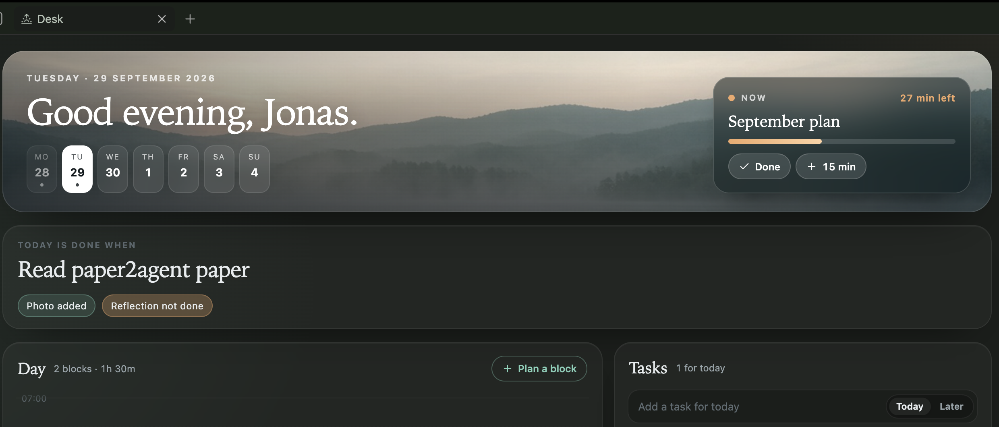
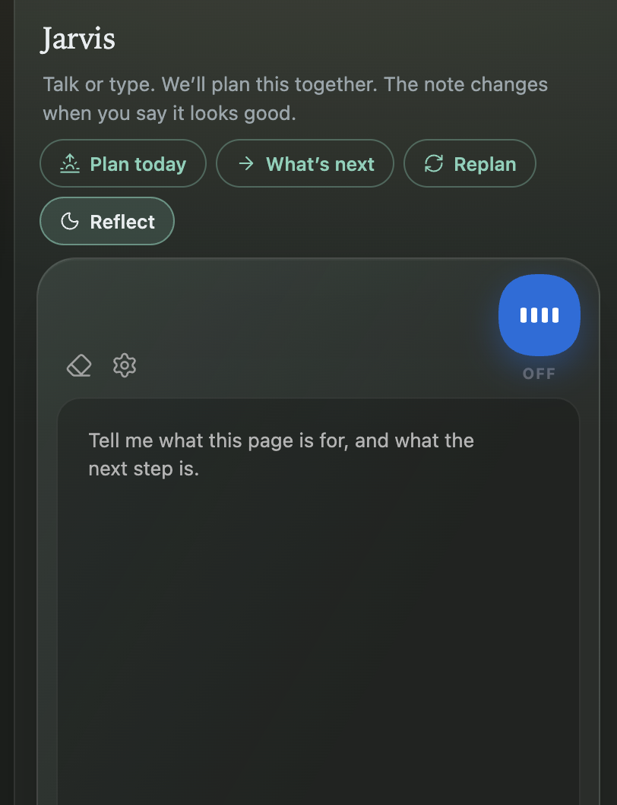

# Vault Talk

First-class [Cursor](https://cursor.com) in [Obsidian](https://obsidian.md). The desk is today’s note. Jarvis sits beside it and uses your Cursor models. A yes writes the vault, and the note updates in place.

Voice is optional. The mic uses [Grok Voice](https://docs.x.ai/developers/model-capabilities/audio/speech-to-speech). With **Edit files** on, Jarvis can list, read, create, and edit markdown. It never deletes.



The desk: greeting, the current block, the goal, the hours, and today’s tasks.



The composer is the Cursor bar: attach a file, pick the model (Grok 4.7, Sonnet 5.5, Opus 5.5, and the rest of your account), set thinking and fast when that model has them, then talk or send. The plan stays in chat until you say it looks good. Then Cursor writes the goal and the blocks.

Desktop only.

## How to use

1. Install the plugin and enable it. A Cursor API key is required for chat: [cursor.com/dashboard/api](https://cursor.com/dashboard/api), or `CURSOR_API_KEY` in a vault `.env`.
2. The desk opens on startup (ribbon **sunrise**, or **Open desk**). The day is on the left. Jarvis is on the right.
3. The composer lists the models on your Cursor account. Thinking and fast appear only when that model has them.
4. **+** attaches a markdown, text, or PDF file to the next message.
5. The mic starts voice. **Dictate** (Ctrl+D) types into the open note. Escape stops either.

Tone and instructions live in vault `Jarvis.md` (`{{date}}`, `{{file}}`, `{{journal}}`, `{{tabs}}`).

## Privacy

Typed chat goes to Cursor. Voice uses the Talk provider you pick. Do not enable writes on a vault you would not trust with that provider.

## Commands

- Open Jarvis
- Toggle dictation

## Development

```bash
npm install
npm run build
```

Symlink `main.js`, `manifest.json`, and `styles.css` into `.obsidian/plugins/vault-talk`.

Releases are the plugin only: tag the plugin repo and GitHub attaches `main.js`, `manifest.json`, and `styles.css` for the [community listing](https://community.obsidian.md/plugins/vault-talk).
